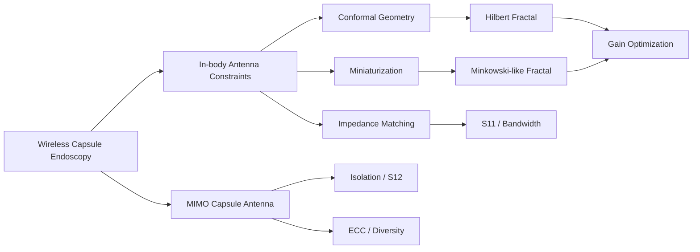

# Capsule Antenna Research

> Wireless capsule endoscopy · conformal antennas · fractal miniaturization · in-body propagation · MIMO

A compact research portfolio and technical notebook for **wireless capsule endoscopy (WCE) antennas**. The repository connects two IEEE ICMMT 2024 publications with a broader undergraduate research direction on **MIMO capsule antennas** and explains the design ideas behind the work rather than redistributing copyrighted paper content.

## Research at a glance

## Selected publications

| Role | Publication | Venue | Links |
|---|---|---|---|
| **First author** | **A High Gain Conformal Antenna Based on Hilbert Fractal for Capsule Endoscopy Application** | IEEE ICMMT 2024 | [IEEE Xplore](https://ieeexplore.ieee.org/document/10672431) · [DOI](https://doi.org/10.1109/ICMMT61774.2024.10672431) |
| **4th author** | **A Minkowski-like Broadband Capsule Antenna Based on Fractal Theory** | IEEE ICMMT 2024 | [IEEE Xplore](https://ieeexplore.ieee.org/document/10672300) · [DOI](https://doi.org/10.1109/ICMMT61774.2024.10672300) |

The ICMMT 2024 proceedings list the Minkowski-like paper immediately before the Hilbert-fractal paper, and the official UESTC feature summarizes both antenna designs and their reported performance.

## Public result snapshots

### Hilbert-fractal conformal antenna

Official UESTC coverage reports a **0.4–3 GHz effective operating range**. In a muscle simulation environment, a resonance near **1.43 GHz** achieved a reported maximum gain of **−18.4 dBi**, with a later project-stage optimization reaching **−11.2 dBi**.

→ [Read the technical case study](docs/03-hilbert-case-study.md)

### Minkowski-like broadband capsule antenna

Official UESTC coverage reports maximum gains of **−24.0 dBi at 915 MHz**, **−22.9 dBi at 1.43 GHz**, and **−19.3 dBi at 2.45 GHz**. A fabricated-test result at **2.45 GHz** is reported at **−20.1 dBi**.

→ [Read the technical case study](docs/04-minkowski-case-study.md)

## Undergraduate research direction

### Design and Analysis of MIMO Capsule Antenna

The later research direction extends single-antenna capsule work toward **MIMO operation**, where the problem is no longer only “make one antenna small and matched.” The design must also manage:

- element coupling and **isolation**;
- impedance matching for multiple ports;
- spatial constraints on a capsule surface;
- radiation behavior in lossy tissue;
- diversity metrics such as **ECC**;
- the trade-off between miniaturization, bandwidth, efficiency, and isolation.

This repository deliberately keeps thesis-specific unpublished figures/results out of the public tree until the original material is explicitly selected for release.

→ [MIMO capsule antenna notes](docs/05-mimo-capsule-antennas.md)

## Technical notebook

| Topic | What it covers |
|---|---|
| [01 · Wireless capsule endoscopy antenna basics](docs/01-wce-antenna-basics.md) | Why in-body antennas are difficult; tissue loading, size, detuning and safety |
| [02 · Fractal antenna fundamentals](docs/02-fractal-antennas.md) | Hilbert and Minkowski geometries; why fractals can increase electrical length |
| [03 · Hilbert case study](docs/03-hilbert-case-study.md) | Public ICMMT 2024 result summary and design interpretation |
| [04 · Minkowski-like case study](docs/04-minkowski-case-study.md) | Public ICMMT 2024 result summary and broadband interpretation |
| [05 · MIMO capsule antennas](docs/05-mimo-capsule-antennas.md) | S12, isolation, ECC, diversity and physical placement |
| [06 · S-parameters, gain and isolation](docs/06-sparameters-gain-isolation.md) | How to read S11/S12, bandwidth and gain correctly |
| [07 · HFSS research workflow](docs/07-hfss-workflow.md) | A reproducible simulation workflow without distributing project files |

## What this repository is — and is not

**Included:** original explanatory notes, public bibliographic metadata, design methodology, equations, interpretation, and links to official sources.

**Not included:** IEEE PDFs, copied paper figures, private HFSS projects, unpublished raw data, or files whose redistribution rights are unclear.

## Sources

Public facts used here are traceable in [SOURCES.md](SOURCES.md). BibTeX entries are available in [references.bib](references.bib).

---

**Research theme:** make antennas physically small enough for a capsule, electrically long enough to radiate, robust enough for tissue loading, and sufficiently decoupled for multi-antenna operation.
