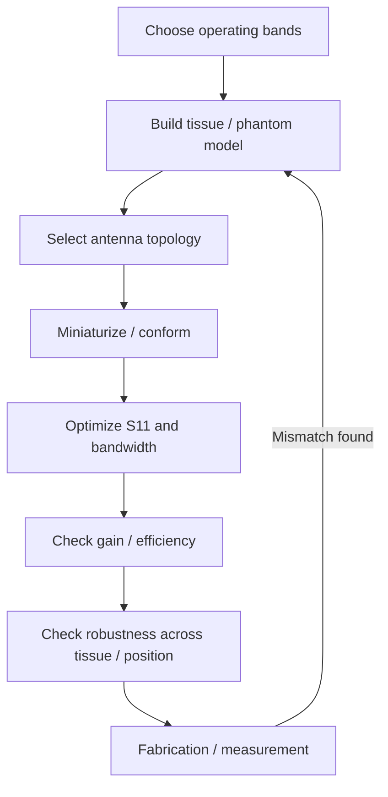

# Wireless Capsule Endoscopy Antenna Basics

Wireless capsule endoscopy (WCE) replaces a wired endoscope with a swallowable device that captures data inside the gastrointestinal tract and transmits it to an external receiver. The antenna therefore operates in a highly constrained electromagnetic environment.

## Why the problem is difficult

### 1. Severe size constraint

A capsule has only a small curved surface and much of its internal volume is occupied by imaging, power, sensing and control electronics. The antenna must therefore provide sufficient electrical length without consuming the volume required by the rest of the system.

### 2. Lossy, high-permittivity tissue

Human tissue is not free space. Its complex permittivity changes the wavelength, antenna input impedance, radiation efficiency and resonance. A geometry that looks well matched in air can shift substantially in an in-body environment.

A simple conceptual relation is

\[
\lambda = \frac{\lambda_0}{\sqrt{\varepsilon_r}}
\]

for a lossless dielectric approximation. Real tissue is lossy, so conductivity must also be included in the material model.

### 3. Conformal geometry

A flat antenna is often wrapped around a capsule wall. Bending changes current paths and electromagnetic coupling. The design should therefore be evaluated in its intended curved geometry rather than only as a planar prototype.

### 4. Matching is not enough

A low \(|S_{11}|\) does not automatically mean a high-gain or efficient antenna. In-body loss can make an antenna well matched while still dissipating a large fraction of input power in surrounding tissue.

### 5. Safety and communication robustness

A practical WCE antenna design also needs to consider SAR constraints, orientation sensitivity, tissue-to-tissue variation and the link budget to the external receiver.

## A useful design loop

## Key lesson

For capsule antennas, the design target is not a single resonance. It is **robust communication under geometric, dielectric and biological constraints**.
